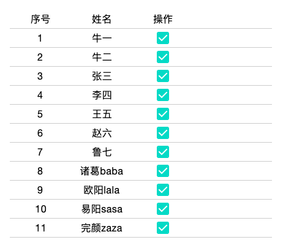
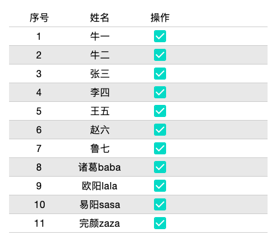
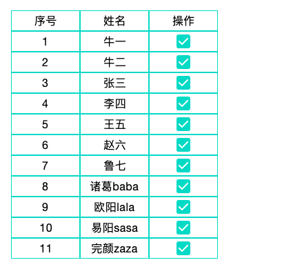
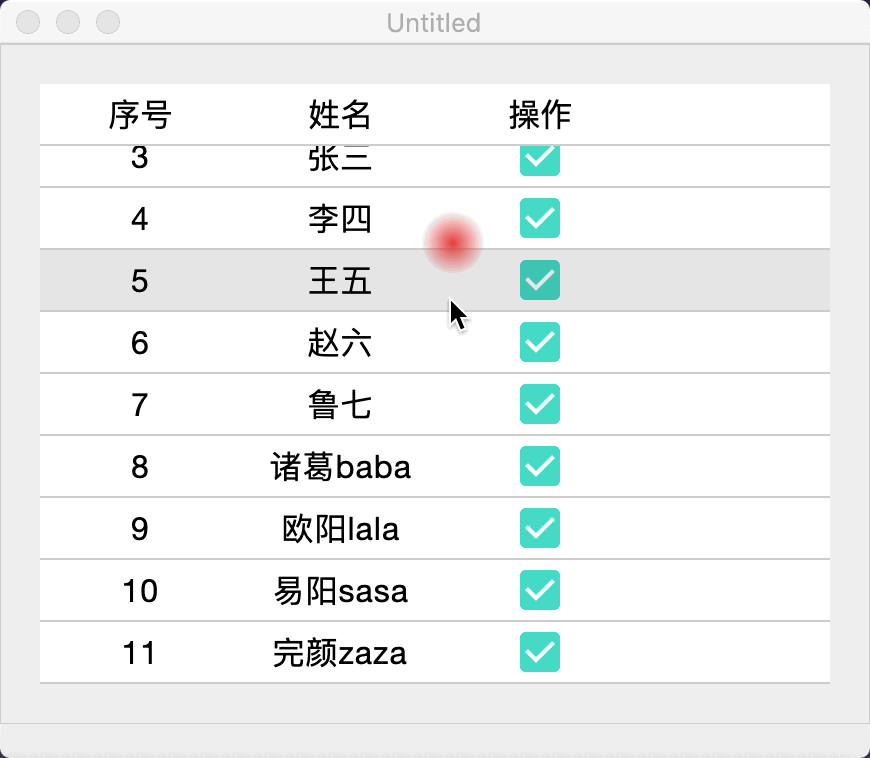
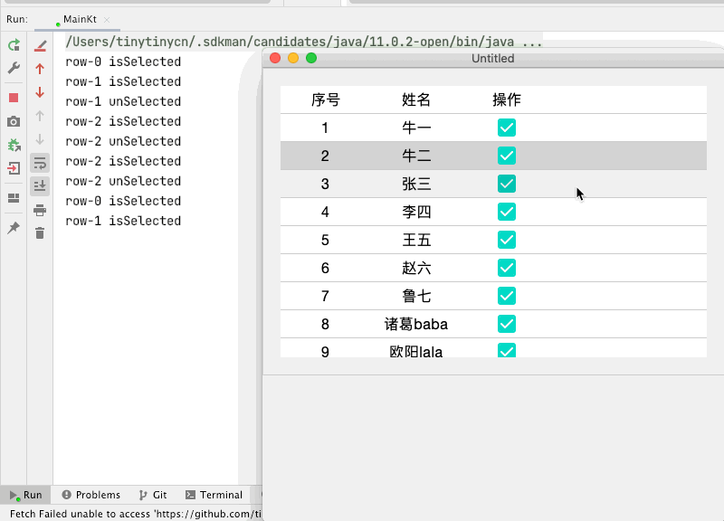

## compose table

Simple table component based on Compose.

基于 compose 实现的一个简单表格组件.

### basic table 基础表格

基础的表格展示:


```kotlin
@OptIn(ExperimentalSerializationApi::class)
@Preview
@Composable
fun SimpleBasicTable() {
    val headers = listOf("序号", "姓名", "操作")
    val bodyData: List<Item> = DataProvider.testItems
    Box(
        Modifier
            .border(border = BorderStroke(Dp.Hairline, color = Color.LightGray))
            .padding(20.dp)
    ) {
        SimpleTable(
            row = bodyData.size,
            col = headers.size,
            headerData = headers
        ) { row, col ->
            when (col) {
                0 -> Text(text = bodyData[row].id.toString(), style = MaterialTheme.typography.body1)
                1 -> Text(text = bodyData[row].name, style = MaterialTheme.typography.body1)
                2 -> Checkbox(checked = bodyData[row].isSelected, onCheckedChange = null)
            }
        }
    }
}
```

### stripe table 带条纹表格
使用带条纹的表格，可以容易区分不同行的数据。使用参数 `stripe=true` 即可。


```kotlin
@OptIn(ExperimentalSerializationApi::class)
@Preview
@Composable
fun SimpleBasicTable() {
    val headers = listOf("序号", "姓名", "操作")
    val bodyData: List<Item> = DataProvider.testItems
    Box(
        Modifier
            .border(border = BorderStroke(Dp.Hairline, color = Color.LightGray))
            .padding(20.dp)
    ) {
        SimpleTable(
            row = bodyData.size,
            col = headers.size,
            stripe = true, // 条纹属性，默认为 false
            headerData = headers
        ) { row, col ->
            when (col) {
                0 -> Text(text = bodyData[row].id.toString(), style = MaterialTheme.typography.body1)
                1 -> Text(text = bodyData[row].name, style = MaterialTheme.typography.body1)
                2 -> Checkbox(checked = bodyData[row].isSelected, onCheckedChange = null)
            }
        }
    }
}
```

### border table 带边框表格
使用带边框的表格， 可以容易区分不同行、不同列的数据。使用参数 `border=true` 即可。



```kotlin
@OptIn(ExperimentalSerializationApi::class)
@Preview
@Composable
fun SimpleBasicTable() {
    val headers = listOf("序号", "姓名", "操作")
    val bodyData: List<Item> = DataProvider.testItems
    Box(
        Modifier
            .border(border = BorderStroke(Dp.Hairline, color = Color.LightGray))
            .padding(20.dp)
    ) {
        SimpleTable(
            row = bodyData.size,
            col = headers.size,
            border = true, // 边框属性，默认为 false
            headerData = headers
        ) { row, col ->
            when (col) {
                0 -> Text(text = bodyData[row].id.toString(), style = MaterialTheme.typography.body1)
                1 -> Text(text = bodyData[row].name, style = MaterialTheme.typography.body1)
                2 -> Checkbox(checked = bodyData[row].isSelected, onCheckedChange = null)
            }
        }
    }
}
```

### fixed header table 固定表头表格
纵向内容过多时，表头是默认固定的。



```kotlin
fun main() = application {
    Window(onCloseRequest = ::exitApplication) {
        val headers = listOf("序号", "姓名", "操作")
        val bodyData: List<Item> = DataProvider.testItems
        Box(
            Modifier
                .border(border = BorderStroke(Dp.Hairline, color = Color.LightGray))
                .padding(20.dp)
        ) {
            SimpleTable(
                modifier = Modifier.height(300.dp),
                row = bodyData.size,
                col = headers.size,
                headerData = headers
            ) { row, col ->
                when (col) {
                    0 -> Text(text = bodyData[row].id.toString(), style = MaterialTheme.typography.body1)
                    1 -> Text(text = bodyData[row].name, style = MaterialTheme.typography.body1)
                    2 -> Checkbox(checked = bodyData[row].isSelected, onCheckedChange = null)
                }
            }
        }
    }
}
```

### single selection 单选表格
**TODO** 暂时没有通过单独的属性分离单选表格某一行的效果。



```kotlin
fun main() = application {
    Window(onCloseRequest = ::exitApplication) {
        val headers = listOf("序号", "姓名", "操作")
        val bodyData: List<Item> = DataProvider.testItems
        Box(
            Modifier
                .border(border = BorderStroke(Dp.Hairline, color = Color.LightGray))
                .padding(20.dp)
        ) {
            SimpleTable(
                modifier = Modifier.height(300.dp),
                row = bodyData.size,
                col = headers.size,
                onRowSelected = { singleSelectionRowIndex, singleSelectionRowToggle ->
                    println("row-$singleSelectionRowIndex ${if (singleSelectionRowToggle) "isSelected" else "unSelected"}")
                },
                headerData = headers
            ) { row, col ->
                when (col) {
                    0 -> Text(text = bodyData[row].id.toString(), style = MaterialTheme.typography.body1)
                    1 -> Text(text = bodyData[row].name, style = MaterialTheme.typography.body1)
                    2 -> Checkbox(checked = bodyData[row].isSelected, onCheckedChange = null)
                }
            }
        }
    }
}
```

### 参考

- [Jetpack Compose Lists](https://developer.android.com/jetpack/compose/lists)
- [ComposeTable](https://github.com/sjzneil/ComposeTable)
- [ComposeDataTable](https://github.com/hashlin/ComposeDataTable)
- [Element UI Table](https://element.eleme.cn/#/zh-CN/component/table)